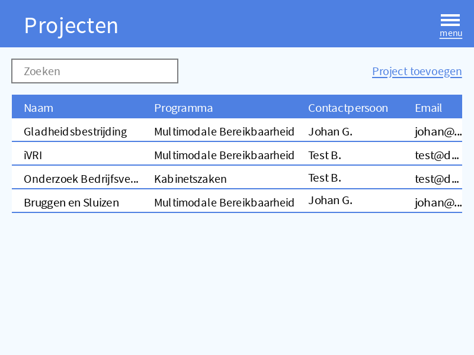
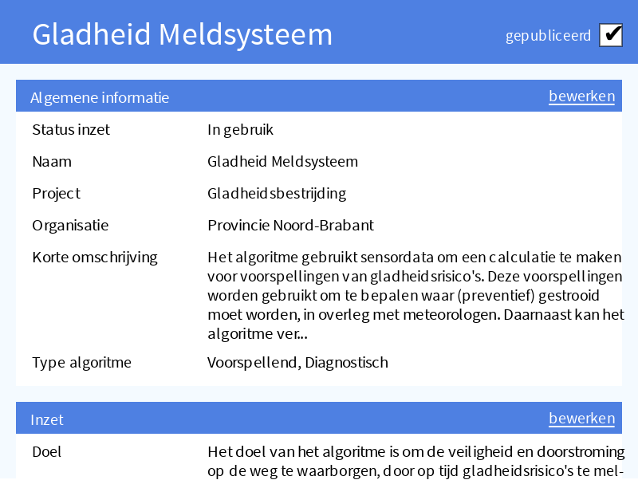
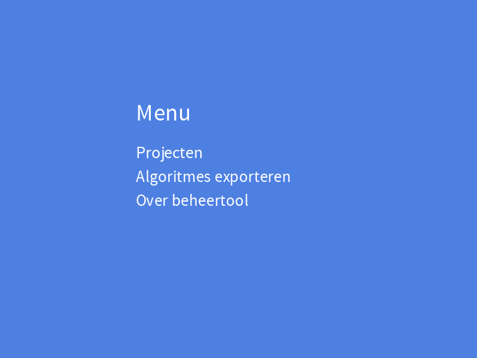
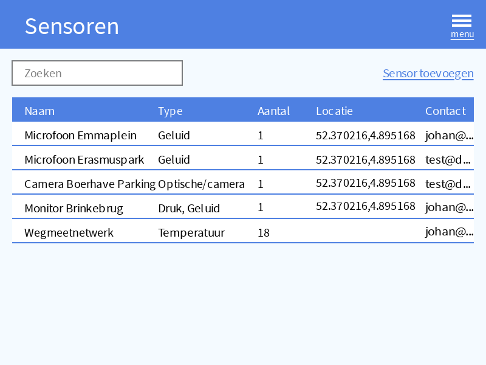

## Over deze website
Dit is de productwebsite voor de Algoritmeregister Beheertool die is ontwikkeld door het [Datalab]() van de [Provincie Noord-Brabant](https://www.brabant.nl/). Op deze pagina stellen wij de huidige (MVP versie 1.0) PowerApp en het Functioneel Ontwerp beschikbaar.

## Achtergrond
De Provincie Noord-Brabant ontwikkelt momenteel een "beheertool" in het kader van publieke controle op algoritmes en het algoritmeregister. Het doel van de beheertool is het ondersteunen van **meer grip** op de verantwoorde inzet van algoritmes in besluitvormings- en uitvoerprocessen, en **meer transparantie** door deze informatie beschikbaar stellen via het [centrale algoritmeregister](https://algoritmes.pleio.nl/cms/view/5129946d-9bf8-4fb9-b15c-e122d1dc02c9/algortimeregister), dat wordt ontwikkeld door het Ministerie van Binnenlandse Zaken en Koninkrijksrelaties, en waar wij pro-actief over meedenken en aan meewerken.

## Product brief

De beheertool is er ter ondersteuning vam de algoritme-expert bij het grip houden op de verantwoorde inzet van technologie in processen en projecten.

De primaire gebruiker is de "algoritme-expert" of "algoritmeverantwoordelijke" binnen de organisatie. Deze persoon is belast met het (toe)zicht houden op de verantwoorde inzet van technologie in de organisatie en daarin begeleiden. In eerste instantie betreft dit de inzet van algoritmes.

De beheertool wordt gebruikt bij:

- het inventariseren van de reeds ingezette technologie
- het dagelijks actueel houden van de registraties
- het begeleiden in projecten waarin technologie wordt ingezet
- het publiceren van publieksinformatie naar (o.a.) het nationale algoritmeregister

Principes die we daarbij hanteren:

- we volgen nationale standaarden voor registratie en publicatie
- deze vullen we waar nodig aan met extra velden voor intern gebruik

*Overzicht van alle projecten*

*Registratie van inzet van tech in projecten*

*Algoritmeregistratie op basis van nationale standaard en extra velden*

*Menu naar applicatie-onderdelen*

*Algoritmes exporteren als Excel voor aanlevering naar nationaal register*

*Sensoren beheren voor gebruik in projecten*

## Open Samenwerking

We nemen het voortouw in ontwerp en ontwikkeling. De beheertool is momenteel in [Alpha](https://en.wikipedia.org/wiki/Software_release_life_cycle#Alpha). Door middel van gebruik in de praktijk wil de Provincie de software iteratief doorontwikkelen en robuuster maken. We werken open en stellen resultaten zoals ontwerp en code open ter beschikking.

Graag trekken we samen op met andere publieke organisaties: zowel met organisaties die onze *PowerApps* implementatie mee willen testen en doorontwikkelen, als met organisaties die op een andere *stack* een eigen implementatie maken of hebben gemaakt - om op organisatorisch, procesmatig en op conceptniveau ideeën en ervaringen uit te wisselen. Neem daarover dus vooral contact op.

## Roadmap en Ideeën

Momenteel wordt gewerkt aan versie 2 van de beheertool, waarin het sensorenregister in de tool wordt ondergebracht voor de registratie van gebruik van sensoren en sensordata in projecten en processen.

Ook werken we met BZK aan het automatisch aanleveren van de algoritmeregistraties naar het centrale algoritmeregister.

Op de [Github issues pagina](https://github.com/Algoritmeregister/beheertool/issues) vind je de openstaande issues waaraan gewerkt wordt.

## Contact

Wil je de beheertool uittesten, samen verbeteren of op een andere manier aan de slag met een algoritmeregister beheertool? Neem dan contact op met .

Voor technische vragen en vragen over de installatie kun je contact opnemen met het [Datalab van de provincie Noord-Brabant](mailto:Datalab@brabant.nl)

## Downloads

[Download Funcioneel Ontwerp (.docx)](downloads/v1.0/Functioneel%20ontwerp%20Algoritmeregister-beheertool.docx)

[Download de PowerApps (.zip)](downloads/v1.0/Algoritmeregister-beheertool.zip)

[Download de Installatiehandleiding (.docx)](downloads/v1.0/Handleiding%20Importeren%20PowerApp%20Algoritmeregister-beheertool.docx)

## Licentie

We zijn van plan om de beheertool onder open licentie beschikbaar te stellen. Momenteel hebben we echter nog geen specifieke licentie(s) gekozen voor bovenstaande downloads. Neem contact op voor meer informatie.
